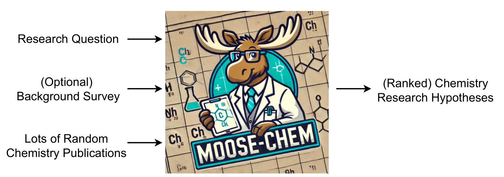

# MOOSE-Chem: Large Language Models for Rediscovering Unseen Chemistry Scientific Hypotheses


[](https://x.com/Yang_zy223)
[](https://github.com/ZonglinY/MOOSE-Chem)
<a href="https://hits.seeyoufarm.com"></a>
[](https://arxiv.org/abs/2410.07076)

We introduce **MOOSE-Chem**, which is an LLM-based multi-agent framework for automated chemistry scientific hypothesis discovery. 

With only LLMs with training data up to October 2023, it has rediscovered many chemistry hypotheses published on Nature, Science, or similar levels in 2024 (also only available online in 2024) with very high similarity, covering the main innovations.


<p align="center" width="100%">
  </a>
</p>

The input to MOOSE-Chem can be as simple as only:

&emsp;(1) *research question*: can be on any chemistry & material science domain;

&emsp;(2) *background survey*: (optionally) a several-paragraph-long survey describing the existing methods for the *research question*;

&emsp;(3) *inspiration corpus*: (this repo contains the default 3000 papers) title and abstract of many (random) chemistry papers that might serve as inspirations for the *research question*, preferably published on top venues.

**MOOSE-Chem** can then output a list of ranked chemistry hypotheses (might take a few hours to "think") that could be both novel and valid.


---------- 

This repo contains all the code of **MOOSE-Chem**, to help every chemistry lab to catalyze their chemistry scientific discovery process.

In general, **MOOSE-Chem** contains three stages:  
&emsp;(1) inspiration retrieval;  
&emsp;(2) hypothesis composition;   
&emsp;(3) hypothesis ranking.

The commands for the three stages are introduced after the "quick start".

## Quick Start

```
git clone https://github.com/ZonglinY/MOOSE-Chem.git
cd MOOSE-Chem
conda create -n msc python=3.8
conda activate msc
pip install -r requirements.txt
```

## Inspiration Retrieval

```
python -u inspiration_screening.py --model_name gpt4 \
        --api_type 0 --api_key ${api_key} --base_url ${base_url} \
        --chem_annotation_path ./Data/chem_research_2024.xlsx \
        --output_dir ./Checkpoints/coarse_inspiration_search_gpt4_corpusSize_300_survey_1_strict_1_numScreen_15_round_4_similarity_0_bkgid_0.json \
        --corpus_size 300 --if_use_background_survey 1 --if_use_strict_survey_question 1 \
        --num_screening_window_size 15 --num_screening_keep_size 3 --num_round_of_screening 4 \
        --if_save 1 --background_question_id 0 --if_select_based_on_similarity 0  \
```

Customized *research question* and *background survey* can be used by modifying ```custom_rq, custom_bs = None, None``` to any string in inspiration_screening.py.

Customized *inspiration corpus* can be adopted by setting ```--title_abstract_all_insp_literature_path``` to your customized file with format ```[[title, abstract], ...]```.


## Hypothesis Composition

```
python -u hypothesis_generation.py --model_name gpt4 \
        --api_type 0 --api_key ${api_key} --base_url ${base_url} \
        --chem_annotation_path ./Data/chem_research_2024.xlsx --corpus_size 300 --if_use_strict_survey_question 1 --if_use_background_survey 1 \
        --inspiration_dir ./Checkpoints/coarse_inspiration_search_gpt4_corpusSize_300_survey_1_strict_1_numScreen_15_round_4_similarity_0_bkgid_0.json \
        --output_dir ./Checkpoints/hypothesis_generation_gpt4_corpus_300_survey_1_gdthInsp_0_intraEA_1_interEA_1_bkgid_0.json \
        --if_save 1 --if_load_from_saved 0 \
        --if_use_gdth_insp 0 --idx_round_of_first_step_insp_screening 1 \
        --num_mutations 3 --num_itr_self_refine 3  --num_self_explore_steps_each_line 3 --num_screening_window_size 12 --num_screening_keep_size 3 \
        --if_mutate_inside_same_bkg_insp 1 --if_mutate_between_diff_insp 1 --if_self_explore 0 --if_consider_external_knowledge_feedback_during_second_refinement 0 \
        --inspiration_ids -1  --recom_inspiration_ids  --recom_num_beam_size 15  --self_explore_inspiration_ids   --self_explore_num_beam_size 15 \
        --max_inspiration_search_steps 3 --background_question_id 0  \
```

Here ```--inspiration_dir``` should be set the same as ```--output_dir``` used in the inspiration retrieval step.

Customized *research question* and *background survey* can be used by modifying ```custom_rq, custom_bs = None, None``` to any string in hypothesis_generation.py.

If used customized *inspiration corpus* in the inspiration retrieval step, ```--title_abstract_all_insp_literature_path``` should be set as the same file as used in the inspiration retrieval step.


## Hypothesis Ranking
```
python -u evaluate.py --model_name gpt4 \
        --api_type 0 --api_key ${api_key} --base_url ${base_url} \
        --chem_annotation_path ./Data/chem_research_2024.xlsx --corpus_size 300 \
        --hypothesis_dir ./Checkpoints/hypothesis_generation_gpt4_corpus_300_survey_1_gdthInsp_0_intraEA_1_interEA_1_bkgid_0.json \
        --output_dir ./Checkpoints/evaluation_gpt4_corpus_300_survey_1_gdthInsp_0_intraEA_1_interEA_1_bkgid_0.json \
        --if_save 1 --if_load_from_saved 0 \
        --if_with_gdth_hyp_annotation 1 \
```

Here ```--hypothesis_dir``` should be set the same as ```-output_dir``` used in the hypothesis composition step.

If used customized *research question* and *background survey*, ```--if_with_gdth_hyp_annotation``` should be set to 0, unless the groundtruth hypothesis can be obtained for the customized *research question* (in this case the function to load groundtruth hypothesis ```load_chem_annotation()``` need to be modified).

If used customized *inspiration corpus* in the inspiration retrieval and hypothesis composition steps, ```--title_abstract_all_insp_literature_path``` should be set as the same file as used in these steps.  


---------

These basic commands for the three stages can also be found in ```main.sh```. 

```Assumption1-RetrieveUnseen.sh``` and ```Assumption2-Reason2Unknown.sh``` contain combinations of these three basic commands (with different arg parameters) to investigate LLMs' ability on these three aspects.

## Analysis

```analysis.py``` can be used to analyze the results of the three stages. 
This [link](https://drive.google.com/file/d/1WdnB5Ztb4n3DNfwJeE9GJW-BJvdoWmNN/view?usp=sharing) stores the result files from all the experiments mentioned in the paper. They can be used with ```analysis.py``` to display the experiment results reported in the paper.

## An Example

Here we present a rediscovered hypothesis from MOOSE-Chem, with input:

(1) a research question && a survey on existing methods for the question; and

(2) 300 random chemistry papers published on Nature or Science, containing two groundtruth inspirations papers.

### Ground Truth Hypothesis

*The main hypothesis is that a **nitrogen-doped ruthenium (Ru)** electrode can effectively catalyze the reductive deuteration of (hetero)arenes in the presence of **D_2O**, leading to high deuterium incorporation into the resulting saturated cyclic compounds. The findings validate this hypothesis by demonstrating that this electrocatalytic method is highly efficient, scalable, and versatile, suitable for a wide range of substrates.*

### Rediscovered Hypothesis

*A pioneering integrated electrocatalytic system leveraging **ruthenium** nanoparticles embedded in **nitrogen-doped** graphene, combined with a dual palladium-coated ion-exchange membrane reactor, will catalyze efficient, scalable, and site-selective reductive deuteration of aromatic hydrocarbons and heteroarenes. Utilizing deuterium sources from both $D_2$ gas and **D_2O**, this system will optimize parameters through real-time machine learning-driven dynamic adjustments. Specific configurations include ruthenium nanoparticle sizes (2-4 nm), nitrogen doping levels (12-14\%), precisely engineered palladium membranes (5 micrometers, ensuring 98\% deuterium-selective permeability), and advanced cyclic voltammetry protocols (1-5 Hz, -0.5V to -1.5V).*

### Expert's analysis 

The proposed hypothesis effectively covers two key points from the ground truth hypothesis: **the incorporation of ruthenium (Ru) and the use of D_2O as a deuterium source** within the electrocatalytic system. However, the current content does not detail the mechanism by which Ru-D is produced, which is essential for explaining the process of reductive deuteration. Nevertheless, the results are still insightful. The specific level of nitrogen doping, for example, is highly suggestive and warrants further investigation. Overall, the match remains strong in its alignment with the original hypothesis while also presenting opportunities for deeper exploration.


## Bib Info
If you found this repository useful, please consider 📑citing:

	@inproceedings{yang2024msc,
	    title = {MOOSE-Chem: Large Language Models for Rediscovering Unseen Chemistry Scientific Hypotheses},
	    author={Yang, Zonglin and Liu, Wanhao and Gao, Ben and Xie, Tong and Li, Yuqiang and Ouyang, Wanli and Poria, Soujanya and Cambria, Erik and Zhou, Dongzhan},
	    booktitle = {ICLR},
	    year = {2025}
	}


